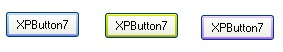



## XPButton

### Description

This is the XP Command Button recreated by me. There are 7 custom borderstyles and of course the original windows xp borderstyle. Like the original button it responds to the mouse entering and leaving. This button has the Default and Cancel Button property so it can be the default button. It also reacts very similarly to the original buttons. It has accesskeys set up so that any alt combo can make the control click (like standard buttons)

You can choose gradient background or solid background (solid is fast, while gradient is slower) The great thing about this control is that I have seen other Xp controls and i have spent so much time making my one fast aswell as good. It can redraw at 2000 times a second (with gradient background) on my Pentium III 866 MHz. Similar controls I have tried redraw at 20 times a second.

Please vote. I have spent a long time on this and I bope that you all like it.
 
### More Info
 

             |
---                |---
**Submitted On**   |2002-12-31 21:43:04
**By**             |[Adam\. A\. Black](https://github.com/Planet-Source-Code/PSCIndex/blob/master/ByAuthor/adam-a-black.md)
**Level**          |Beginner
**User Rating**    |4.8 (67 globes from 14 users)
**Compatibility**  |VB 6\.0
**Category**       |[Custom Controls/ Forms/  Menus](https://github.com/Planet-Source-Code/PSCIndex/blob/master/ByCategory/custom-controls-forms-menus__1-4.md)
**World**          |[Visual Basic](https://github.com/Planet-Source-Code/PSCIndex/blob/master/ByWorld/visual-basic.md)
**Archive File**   |[XPButton1549542242003\.zip](https://github.com/Planet-Source-Code/adam-a-black-xpbutton__1-43483/archive/master.zip)

